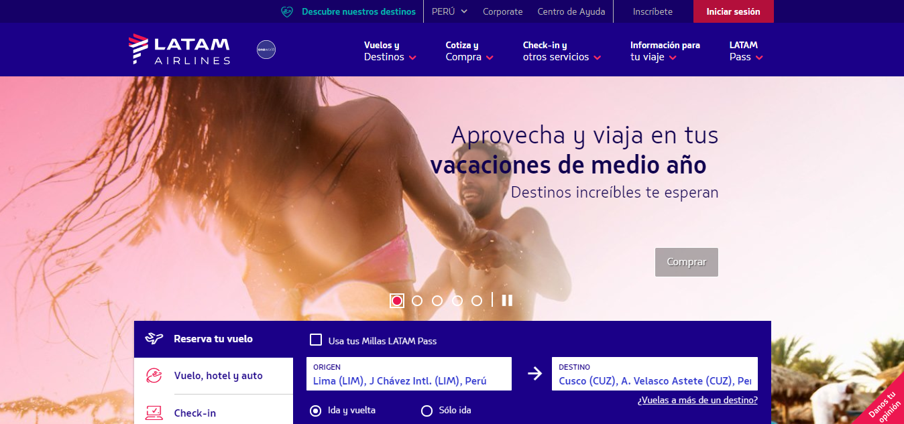

# RETO UX:

 Rediseña app con mejor en experiencia del calendario
Cuando sacamos una cita para el médico, compramos un pasaje de avión o de bus, hacemos una reserva para un hotel, programamos un viaje en Uber, nos creamos una cuenta en alguna página, reservamos un libro en una biblioteca, programamos un webinar, pagamos con una tarjeta de crédito, etc. interactuamos con un calendario para ingresar la fecha. La experiencia usando estos calendarios es variada, hay unos que están muy bien ajustados a lo que necesitamos (en algunos casos inmediatez, en otros seguridad o flexibilidad) y otras (varias) en los que terminan siendo una gran barrera para que un usuario termine de cumplir su objetivo y por el contrario, termina abandonando el producto.

Escoge un mercado, cualquiera de los mencionamos anteriormente, y encuentra cuál es la mejor manera de mostrar un calendario, tanto en desktop como en móvil.

 

## OBJETIVO DEL PROYECTO:

 Brindar un mejor acceso a la plataforma de Latam Airlines y un despliege de calendario que proporcione toda la información necesaria sin generar  complicaciones en el transcurso de reserva de un pasaje de avión.
